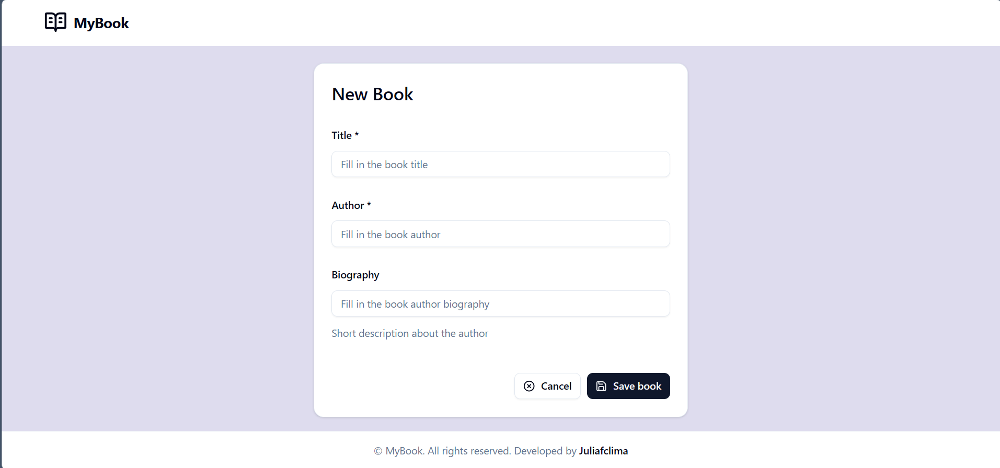
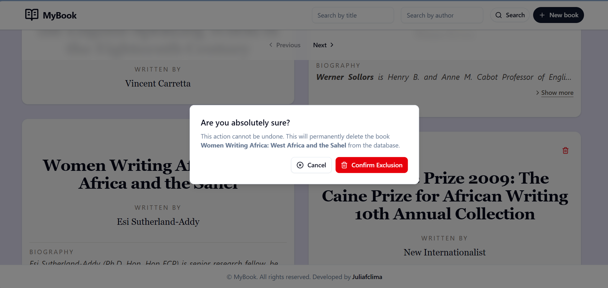

# Frontend - Murabei Books

## Descrição

Frontend da aplicação **Murabei Books**, desenvolvido em **Next.js 16** com **React 19** e **TypeScript**. A aplicação oferece uma interface para gerenciamento de um catálogo de livros, com funcionalidades de listagem, busca por autor e titulo, criação e exclusão de livros.

---
## Imagens





---

## Estrutura do Projeto

```
frontend/
├── src/
│   ├── app/                          # Next.js App Router
│   │   ├── globals.css               # Estilos globais (Tailwind)
│   │   ├── layout.tsx                # Layout raiz
│   │   ├── page.tsx                  # Página inicial (Home)
│   │   ├── not-found.tsx             # Página 404 customizada
│   │   ├── actions/                  # Server Actions
│   │   │   ├── createBook.ts         # Ação para criar livro
│   │   │   └── deleteBook.ts         # Ação para deletar livro
│   │   ├── context/
│   │   │   └── bookContext.tsx       # Context API para estado de livros
│   │   ├── new-book/
│   │   │   └── page.tsx              # Página para criar novo livro
│   │   ├── services/                 # Serviços de API
│   │   │   ├── api.ts                # Cliente HTTP (fetch wrapper)
│   │   │   └── booksService.ts       # Serviços específicos de livros
│   │   └── types/
│   │       ├── book.ts               # Interfaces TypeScript
│   │       └── styles.d.ts           # Type definitions de CSS
│   ├── components/                   # Componentes React reutilizáveis
│   │   ├── bookCard.tsx              # Card individual do livro
│   │   ├── bookCardSkeleton.tsx      # Skeleton loader para card
│   │   ├── bookGrid.tsx              # Grid de livros
│   │   ├── loading.tsx               # Componente de loading
│   │   ├── modalDeleteBook.tsx       # Modal de confirmação de deleção
│   │   ├── paginationContainer.tsx   # Controle de paginação
│   │   ├── layout/                   # Componentes de layout
│   │   │   ├── footer.tsx            # Rodapé
│   │   │   ├── header.tsx            # Cabeçalho
│   │   │   └── searchBy.tsx          # Barra de busca
│   │   └── ui/                       # Componentes shadcn/ui
│   │       ├── alert-dialog.tsx      
│   │       ├── button.tsx            
│   │       ├── card.tsx              
│   │       ├── field.tsx             
│   │       ├── input.tsx             
│   │       ├── label.tsx             
│   │       ├── pagination.tsx        
│   │       ├── select.tsx            
│   │       ├── separator.tsx         
│   │       ├── skeleton.tsx          
│   │       ├── sonner.tsx            
│   │       ├── spinner.tsx           
│   │       └── tooltip.tsx           
│   └── lib/
│       └── utils.ts                  
├── public/                           
├── .env                               
├── .dockerignore                      
├── .gitignore                         
├── .eslintrc.config.mjs               
├── Dockerfile                         
├── build.sh                           
├── components.json                    
├── eslint.config.mjs                  
├── next.config.ts                     
├── package.json                       
├── postcss.config.mjs                 
├── tailwind.config.ts                 
├── tsconfig.json                      
├── version                            
└── readme.md                          
```

---

## Quick Start

### Pré-requisitos
- Node.js 18+ e npm 9+
- Docker (para rodar containerizado)
- Git

### Instalação Local

#### 1. Clonar o Repositório
```bash
git clone https://github.com/juliafclima/murabei-test.git
cd murabei-test/frontend
```

#### 2. Instalar Dependências
```bash
npm install
```

#### 3. Configurar Variáveis de Ambiente
Crie um arquivo `.env` na raiz do projeto:
```env
API_URL=https:/murabei-test-production-9cab.up.railway.app
```

#### 4. Rodar em Desenvolvimento
```bash
npm run dev
```

Acesse http://localhost:3000 no navegador.

---

## Docker

### Build da Imagem
```bash
cd frontend
bash build.sh
```

O script executará:
```bash
source version
docker build -t frontend:latest .
```

### Rodar Container Localmente
```bash
docker run -p 3000:8080 -e API_URL=http://localhost:5000 frontend:latest
```

### Com Docker Compose (Stack Completa)
```bash
cd _docker-compose
docker-compose up -d
```

Isto irá subir:
- Frontend na porta 3000
- Backend na porta 5000

### Variáveis de Ambiente no Docker
Defina no `docker-compose.yml`:
```yaml
environment:
  - API_URL=http://backend:5000
```

---

## Decisões Técnicas

### Tailwind CSS 4

**Escolha de CSS:**
- Utility-first approach reduz CSS customizado
- Compilação otimizada com purging automático
- Temas e customizações fáceis
- Performance superior ao CSS tradicional

### shadcn/ui para Componentes

**Por que shadcn/ui?**
- Componentes acessíveis construídos com Radix UI
- Totalmente customizáveis com Tailwind CSS
- Código copiado (não dependência npm) para máximo controle
- Copy-paste driven development para flexibilidade

**Componentes utilizados:**
- `AlertDialog` - Modal de confirmação
- `Button` - Botão
- `Card` - Container de conteúdo
- `Input` - Campo de entrada
- `Select` - Dropdown
- `Pagination` - Paginação
- `Skeleton` - Loading states

### Context API para State Management

**Escolha:**
- Projeto pequeno/médio (não precisa Redux)
- Context API é suficiente para compartilhar estado
- Menos dependências
- Melhor performance que Redux para este caso

**bookContext.tsx:**
```typescript
interface BookContextType {
  books: Book[];
  loading: boolean;
  error: string | null;
  page: number;
}
```

### Server Actions para Mutações

**Benefícios:**
- Segurança: Lógica sensível no servidor
- Menos JavaScript no cliente
- Revalidação automática de dados
- Tratamento de erros simplificado

### Sonner para Toast Notifications

- Melhor UX com animations
- Type-safe
- Suporte a promises
- Tema customizável

```typescript
import { toast } from 'sonner'

toast.success('Livro criado com sucesso!')
toast.error('Erro ao deletar livro')
```

---

## Integração com Backend

### Endpoints Utilizados

```
GET  /api/v1/books                    # Listar livros
GET  /api/v1/books/search/title?q=    # Buscar por título
GET  /api/v1/books/search/author?q=   # Buscar por autor
POST /api/v1/books                    # Criar livro
DELETE /api/v1/books/<id>             # Deletar livro
```

### Tratamento de Erros

```typescript
try {
  await createBook(formData)
  toast.success('Livro criado!')
} catch (error) {
  toast.error('Erro ao criar livro')
  console.error(error)
}
```

---

## Fluxo de Dados

```
User Interaction
      ↓
<BookCard /> ou <SearchBy />
      ↓
Server Action (createBook.ts / deleteBook.ts)
      ↓
services/api.ts (HTTP request)
      ↓
Backend API (Flask)
      ↓
Database (SQLite)
      ↓
HTTP Response
      ↓
Context API (bookContext.tsx) - atualizar estado
      ↓
Re-render componentes
      ↓
toast.success() / toast.error()
```

---

## Deploy

### Railway

Frontend: https://murabei-test-production.up.railway.app/

Backend: https://murabei-test-production-9cab.up.railway.app/


## Referências usadas

- [Next.js Docs](https://nextjs.org/docs)
- [React 19 Docs](https://react.dev)
- [TypeScript Handbook](https://www.typescriptlang.org/docs)
- [Tailwind CSS](https://tailwindcss.com/docs)
- [shadcn/ui](https://ui.shadcn.com)
- [Radix UI](https://www.radix-ui.com)
- [Sonner Toast](https://sonner.emilkowal.ski)

---
## 👩‍💻 Desenvolvido por **Júlia Lima**

- LinkedIn: https://www.linkedin.com/in/juliafclima
- GitHub: https://github.com/juliafclima
- Portfólio: https://www.juliafclima.software/